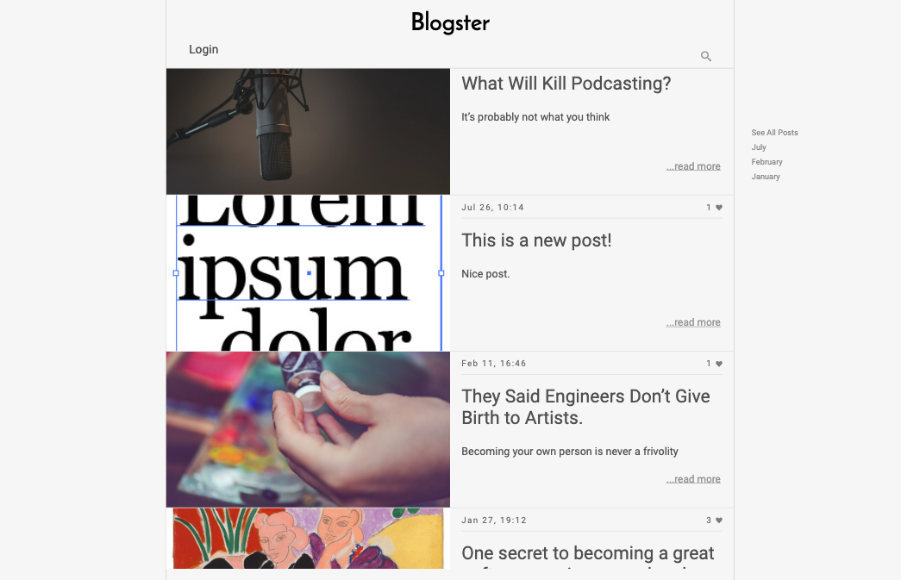
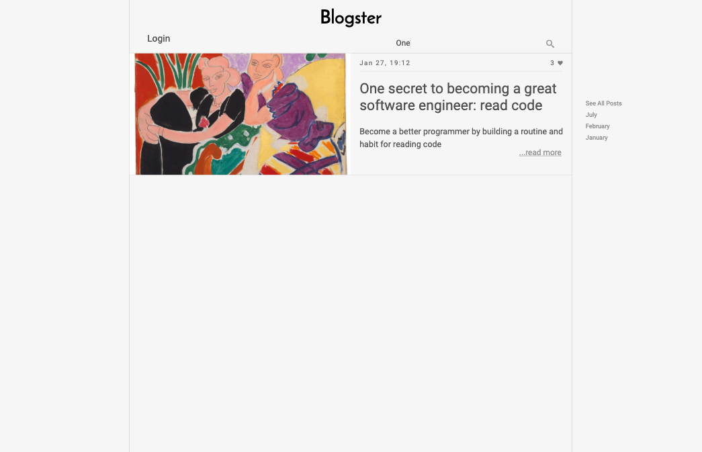
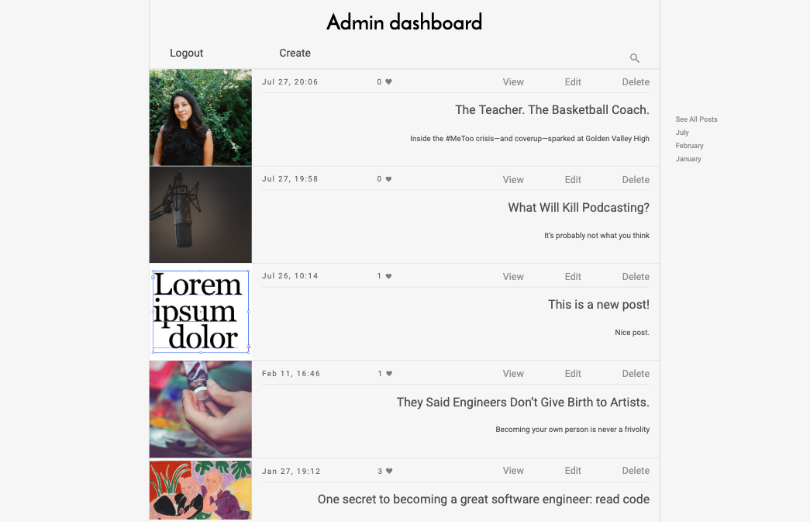
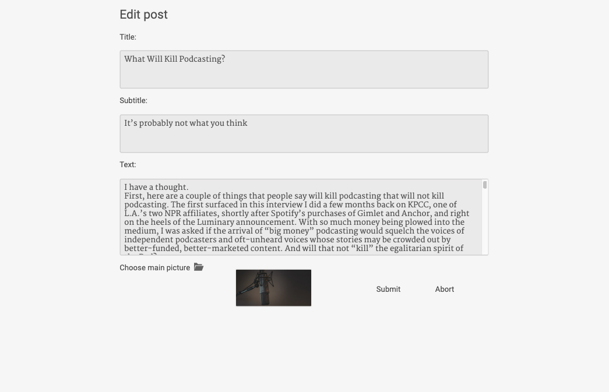
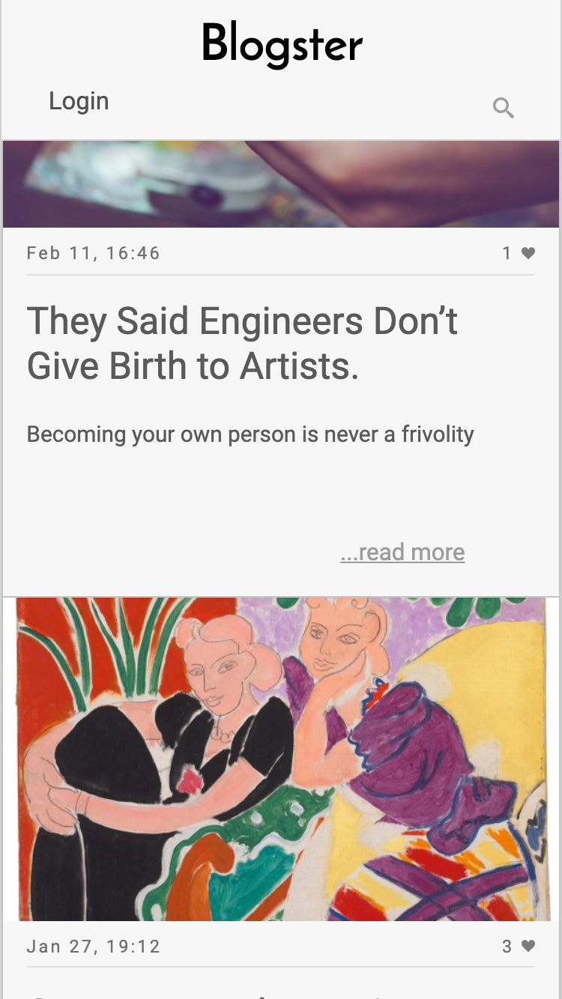
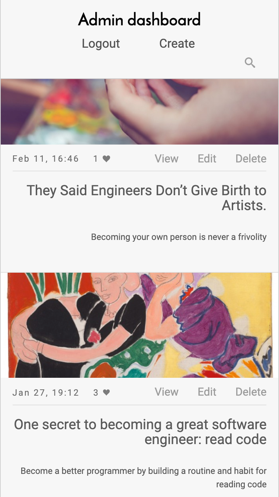

# Blogster

Simple blog app.

Loosely inspired by Medium.

Made to summarize knowledge about React, Redux and Firebase.

## Live 
https://blogster-react-app.herokuapp.com/
> Notice: The app is hosted on Heroku, so the initial load may take some time. Please, give it a few seconds.

## Guide
You can use it as a guest or you can login with your Google account to modify data. 
For the demonstration purpose, everyone with Google account can access admin route. 
The app uses Firebase Auth for user authentication.

## Features
- Create posts with uploaded image
- Modify posts
- Delete posts
- Comment posts
- Dynamic search in posts titles
- In desktop on the right side there is filter panel with dynamically generated months, so you can display posts from a certain month
- Add likes under posts and comments 

## Stack
##### Front-end
- React
- Redux
- CSS ( SASS )
##### Back-end (serve static files)
- Node
- Express
##### Firebase
- Auth
- Realtime Database
- Storage
##### Tools & noticeable dependencies
- Webpack
- Babel
- moment.js
- react-router
- numeral

## Screenshots
 
Main page  

 
Search results  

 
Admin dashboard  

 
Edit post  

 
Main page mobile  

 
Admin dashboard mobile  

## Links

- Live: https://blogster-react-app.herokuapp.com/
> Notice: The app is hosted on Heroku, so the initial load may take some time. Please, give it a few seconds.
- Repository: https://github.com/EmilTheSadCat/react-blog-app

## Licensing

The code in this project is licensed under MIT license.
